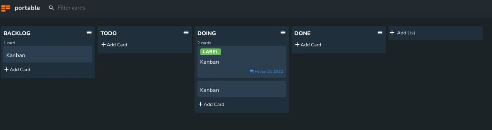

# Portable Kanban Extension for Visual Studio Code

This extension kanban board for Visual Studio Code.

## Using Kanban

Create new Kanban in the Command Pallet (ctrl+shift+P).

## TODO :construction:

- Sync with Github Project
- Sync with Trello
- Add a related card to a card