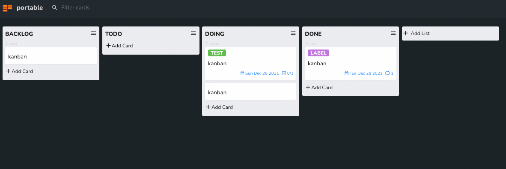

# Portable Kanban Extension for Visual Studio Code

This extension kanban board for Visual Studio Code.

## Using Kanban

Create new Kanban in the Command Pallet (ctrl+shift+P).

## TODO

- [ ] Sync with Github Project
- [ ] Sync with Trello