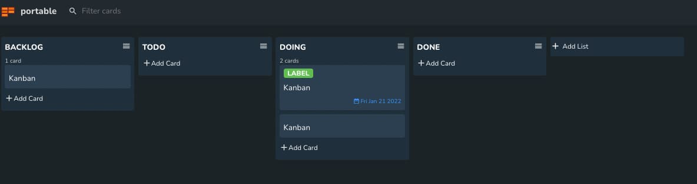

<h1 align="center">Portable Kanban</h1>

A lightweight, portable kanban board that lives in your filesystem as a plain `.kanban` (JSON) file.  
Works across **VS Code**, **Neovim**, and the **Web browser** — all reading and writing the same file.




## Features

- ✅ Drag and drop cards between lists (VS Code / Web)
- ✅ Add descriptions, labels, due dates, and comments to cards
- ✅ Task lists with checkboxes
- ✅ Archive cards and lists
- ✅ Search and filter functionality
- ✅ Dark / Light / System theme support
- ✅ Plain JSON `.kanban` file format — Git-friendly and human-readable
- ✅ **MCP server** — AI assistants can read and edit boards via Model Context Protocol

---

## Repository Structure

This is a **pnpm monorepo** containing the following packages:

```
portable-kanban/
├── apps/
│   ├── vscode/      # VS Code extension
│   ├── web/         # Browser-based kanban app (File System Access API)
│   ├── nvim/        # Neovim plugin + terminal TUI (Ink / React)
│   └── mcp/         # MCP server (AI tool integration)
└── packages/
    ├── core/        # Shared data models, decoders, and utilities
    └── ui/          # Shared React UI components (board, cards, etc.)
```

| Package | Name | Description |
|---------|------|-------------|
| `apps/vscode` | `portable-kanban` | VS Code custom editor for `.kanban` files |
| `apps/web` | `@portable-kanban/web` | Web app with File System Access API |
| `apps/nvim` | `@portable-kanban/nvim` | Neovim Lua plugin + Ink TUI |
| `apps/mcp` | `@portable-kanban/mcp` | MCP server for AI tool integration |
| `packages/core` | `@portable-kanban/core` | Data models, JSON decoder/encoder |
| `packages/ui` | `@portable-kanban/ui` | React kanban board UI (shared) |

---

## MCP Server (AI Integration)

The MCP server lets AI assistants (Claude Desktop, GitHub Copilot, etc.) read and manipulate `.kanban` files using the [Model Context Protocol](https://modelcontextprotocol.io/).

### Build

```bash
pnpm build:mcp
```

### Setup — Claude Desktop

Add to `~/Library/Application Support/Claude/claude_desktop_config.json`:

```json
{
  "mcpServers": {
    "portable-kanban": {
      "command": "node",
      "args": [
        "/path/to/portable-kanban/apps/mcp/dist/index.js",
        "/path/to/your/boards/"
      ]
    }
  }
}
```

### Setup — GitHub Copilot CLI (`.github/copilot-instructions.md` or MCP config)

```json
{
  "mcpServers": {
    "portable-kanban": {
      "command": "node",
      "args": ["/path/to/portable-kanban/apps/mcp/dist/index.js", "."]
    }
  }
}
```

### Available Tools

**Basic operations:**

| Tool | Description |
|------|-------------|
| `list_boards` | List all `.kanban` files |
| `read_board` | Read a board (all lists and cards) |
| `get_card` | Get full details of a single card |
| `add_card` | Add a card to a list |
| `edit_card` | Edit title / description / due date |
| `move_card` | Move a card to another list |
| `delete_card` | Delete a card |
| `add_list` | Add a new list |
| `add_task` | Add a task (checkbox) to a card |
| `toggle_task` | Toggle a task checkbox |
| `add_comment` | Add a comment to a card |

**Agentic workflow tools:**

| Tool | Description |
|------|-------------|
| `get_next_card` | Get the first card from a list (pick next task to work on) |
| `start_card` | Move card to "Doing" + record start timestamp comment |
| `complete_card` | Check all tasks + move to "Done" + record completion comment |

### Agentic task execution workflow

The intended pattern for an AI agent working through a backlog:

```
1. get_next_card(board="work", list="To Do")
   → returns card title, ID, description, and task list

2. start_card(board="work", card_id="<id>")
   → moves card to "Doing", records "[agent] Started at 2026-05-24 12:00"

3. ... agent performs the actual work ...
   → toggle_task(card_id, task_index=1)  ← mark each subtask done
   → toggle_task(card_id, task_index=2)
   → add_comment(card_id, "Found issue X, resolved by Y")

4. complete_card(board="work", card_id="<id>", summary="Implemented X, fixed Y")
   → checks all remaining tasks, moves to "Done"
   → records "[agent] Completed at 2026-05-24 12:05\nImplemented X, fixed Y"

5. Repeat from step 1 for the next card
```

### Example prompts

```
"Work through all cards in the To Do list"
"Show me my kanban board"
"Move the 'Fix login bug' card to Done"
"Add a card 'Write tests' to the To Do list with due date 2026-06-01"
"Mark task 2 on card abc-123 as done"
"Add a comment 'Reviewed and approved' to the API card"
```

---

## VS Code Extension

### Installation

**From VS Code Marketplace:**
1. Open VS Code
2. Go to Extensions (`Ctrl+Shift+X`)
3. Search for **"Portable Kanban"**
4. Click Install

**From Command Line:**
```bash
ext install portable-kanban
```

### Getting Started

1. Open Command Palette (`Ctrl+Shift+P` / `Cmd+Shift+P`)
2. Run **"Portable Kanban: Create new Kanban"**
3. Choose a location — the `.kanban` file opens as a board in a new tab

### Configuration

```json
{
  "portable-kanban.theme": "system",        // "dark" | "light" | "system"
  "portable-kanban.show-description": true, // Show card descriptions
  "portable-kanban.show-task-list": true    // Show task lists in cards
}
```

### Keyboard Shortcuts

| Key | Action |
|-----|--------|
| `Escape` | Close modal / dialog |
| `Enter` | Confirm edit |
| `Shift+Enter` | Add multiple items at once |

---

## Web App

A browser-based kanban board using the [File System Access API](https://developer.mozilla.org/en-US/docs/Web/API/File_System_API).

> **Note:** Requires a Chromium-based browser (Chrome / Edge) for full file read/write support.

### Usage

```bash
pnpm dev:web      # Start dev server → http://localhost:5173
pnpm build:web    # Production build
```

1. Open `http://localhost:5173`
2. Click **Open file** to open an existing `.kanban` file
3. Click **New file** to create a new board
4. Changes are saved automatically to the file

---

## Neovim Plugin

### Installation

**Prerequisites:** Node.js 18+, pnpm

```bash
# Build the TUI
cd apps/nvim
pnpm install
pnpm build
```

**vim-plug** (`init.vim` / `init.lua`):

```vim
" init.vim
Plug '/path/to/portable-kanban/apps/nvim'
```

After adding the line, run `:PlugInstall`, then configure:

```vim
" init.vim
lua require("portable-kanban").setup({ auto_open = true })
```

```lua
-- init.lua
require("portable-kanban").setup({ auto_open = true })
```

---

**lazy.nvim**:

```lua
{
  dir = "/path/to/portable-kanban/apps/nvim",
  config = function()
    require("portable-kanban").setup({
      auto_open = true,  -- Auto-open TUI when a .kanban file is opened (optional)
    })
  end,
}
```

---

**packer.nvim**:

```lua
use {
  "/path/to/portable-kanban/apps/nvim",
  config = function()
    require("portable-kanban").setup({ auto_open = true })
  end,
}
```

---

**Manual** (`init.lua` / `init.vim`):

```lua
-- init.lua
vim.opt.rtp:prepend("/path/to/portable-kanban/apps/nvim")
require("portable-kanban").setup()
```

### Commands

| Command | Description |
|---------|-------------|
| `:KanbanOpen` | Open the current `.kanban` file in the TUI |
| `:KanbanNew` | Create a new `.kanban` file and open it |

### TUI Keybindings

**Board view:**

| Key | Action |
|-----|--------|
| `←` / `h` | Move to left list |
| `→` / `l` | Move to right list |
| `↑` / `k` | Select card above |
| `↓` / `j` | Select card below |
| `Enter` | Open card detail |
| `a` | Add new card to current list |
| `e` | Edit selected card title |
| `d` | Delete selected card |
| `H` | Move selected card to left list |
| `L` | Move selected card to right list |
| `q` / `Ctrl+C` | Quit |

**Card detail view:**

| Key | Action |
|-----|--------|
| `1`–`9` | Toggle checkbox task |
| `Esc` / `q` | Back to board |

---

## File Format

`.kanban` files are plain JSON:

```json
{
  "lists": [
    {
      "id": "uuid",
      "title": "To Do",
      "cards": [
        {
          "id": "uuid",
          "listId": "parent-list-uuid",
          "title": "My task",
          "description": "Details here",
          "dueDate": "2026-06-01",
          "labels": [{ "id": "uuid", "title": "bug", "color": "#eb5a46" }],
          "checkboxes": [{ "id": "uuid", "title": "Step 1", "checked": false }],
          "comments": [{ "id": "uuid", "comment": "Looks good!" }]
        }
      ]
    }
  ],
  "archive": { "lists": [], "cards": [] },
  "settings": { "labels": [] }
}
```

---

## Development

### Prerequisites

- Node.js 18+
- pnpm 8+

### Setup

```bash
git clone https://github.com/harehare/portable-kanban.git
cd portable-kanban
pnpm install
```

### Build

```bash
pnpm build:core    # Build shared core package
pnpm build:ui      # Build shared UI package
pnpm build:vscode  # Build VS Code extension
pnpm build:web     # Build web app
pnpm build:nvim    # Build Neovim TUI
```

### Development Servers

```bash
pnpm dev:vscode    # Watch mode for VS Code extension
pnpm dev:web       # Vite dev server for web app (http://localhost:5173)
pnpm dev:nvim      # Watch mode for Neovim TUI
```

### Testing & Linting

```bash
pnpm test          # Run all tests (vitest)
pnpm lint          # Run linter
```

---

## Contributing

1. Fork the repository
2. Create a feature branch (`git checkout -b feature/amazing-feature`)
3. Commit your changes
4. Push the branch and open a Pull Request

## License

MIT License

## Support

- 🐛 [Report bugs](https://github.com/harehare/portable-kanban/issues)
- 💡 [Request features](https://github.com/harehare/portable-kanban/issues)
- ⭐ [Star the project](https://github.com/harehare/portable-kanban) if you find it useful!
